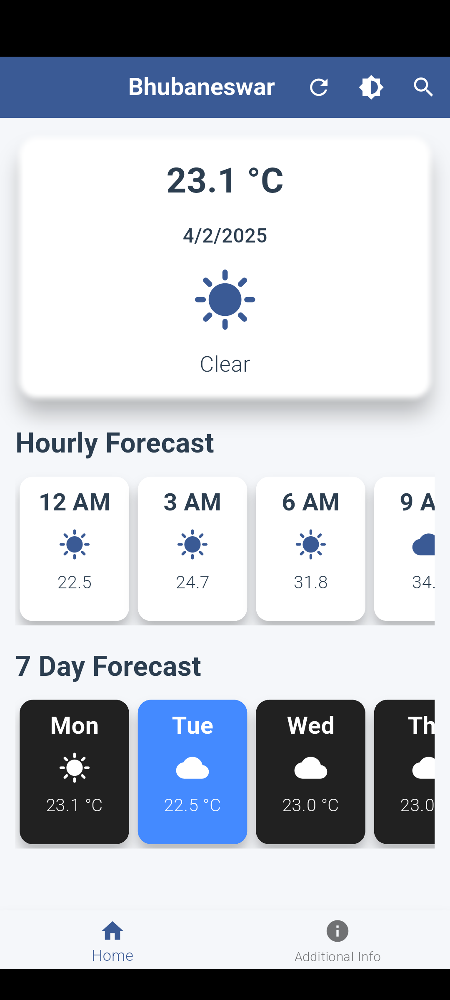
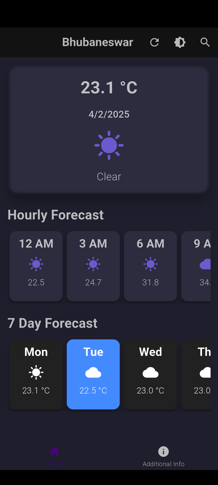
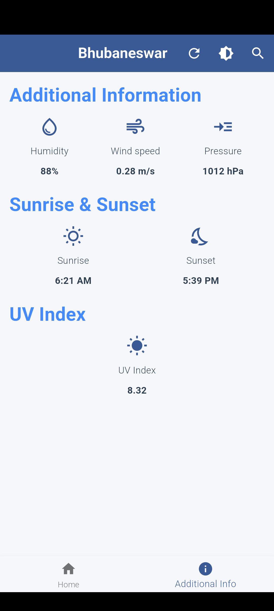

# Weather App

A Flutter-based weather application that provides current weather information and a 7-day forecast for various cities. The app fetches data from the OpenWeatherMap API and displays it in a user-friendly interface.

## Features

- **Current Weather**: Displays the current temperature, weather conditions, and other relevant information for the selected city.
- **5-Day Forecast**: Provides a 5-day weather forecast with daily temperatures and conditions.
- **City Selection**: Allows users to select a city from a list fetched from an API.
- **Additional Information**: Displays additional weather-related information such as humidity and pressure.

## Screenshots

   

## Getting Started

### Prerequisites

- [Flutter](https://flutter.dev/docs/get-started/install) (latest version)
- [Dart](https://dart.dev/get-dart) (latest version)

### Installation

1. Clone the repository:
    ```sh
    git clone https://github.com/arpanz/weather.git
    cd weather
    ```

2. Install dependencies:
    ```sh
    flutter pub get
    ```

3. Run the app:
    ```sh
    flutter run
    ```

## Usage

1. Launch the app on your preferred device or emulator.
2. The home screen displays the current weather for the default city.
3. Tap the city icon in the app bar to open the city selection dialog.
4. Select a city from the list to update the weather information.
5. Use the bottom navigation bar to switch between the home screen and additional information screen.

## API Integration

This app uses the [OpenWeatherMap API](https://openweathermap.org/api) to fetch weather data. You need to obtain an API key from OpenWeatherMap and add it to the `we_key.dart` file:

```dart
const String openweatherApiKey = 'YOUR_API_KEY';
